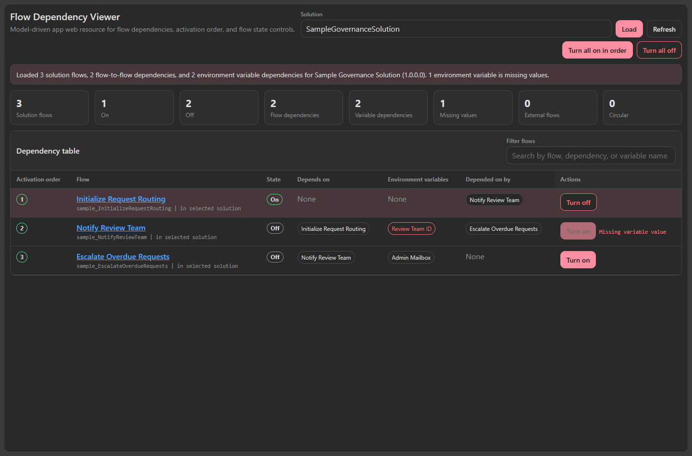
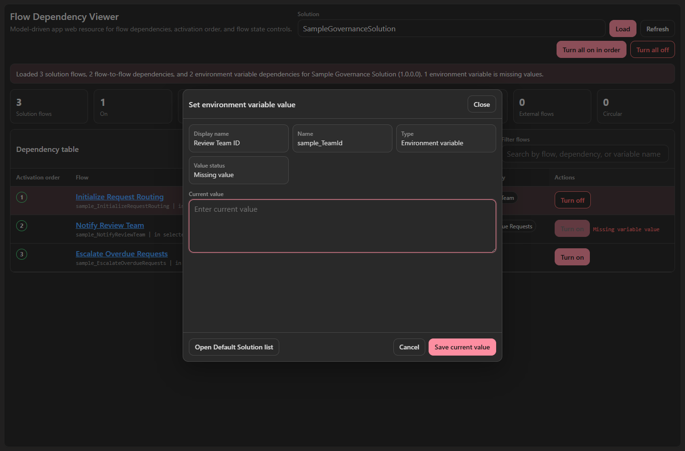

# Flow Dependency Viewer

## Purpose

The **Flow Dependency Viewer** web resource helps administrators understand and safely manage Power Automate cloud flows that are shipped in Dataverse solutions.

It is designed for scenarios like:

- Seeing which solution cloud flows depend on other cloud flows
- Seeing which flows depend on a selected flow
- Calculating the order flows should be turned on
- Finding environment variables referenced by each flow
- Flagging environment variables that are missing both current and default values
- Opening flows directly and editing environment variable values from the table
- Blocking flow activation until that flow's referenced environment variables have values

## Files

Repository paths:

[tools\flow-dependency-viewer\solution\src\WebResources\fdv_\flowdependencyviewer.htm](../tools/flow-dependency-viewer/solution/src/WebResources/fdv_/flowdependencyviewer.htm)

[Unmanaged ZIP](../packages/flow-dependency-viewer/FlowDependencyViewerSolution.zip)

[Managed ZIP](../packages/flow-dependency-viewer/FlowDependencyViewerSolution_managed.zip)

Use the unmanaged ZIP in development environments. Use the managed ZIP for test or production after validating the behavior in your tenant.

The packaged solution contains the HTML web resource only.

## Screenshots





## Where to use it

Import the solution ZIP, then add the `fdv_\flowdependencyviewer.htm` web resource to an admin model-driven app as a standalone page/navigation item.

The page can load a solution by unique name, friendly name, or solution ID. You can also pass a default value through the web resource URL:

```text
solutionReference=CenterofExcellenceCoreComponents
```

To force dark mode using the same convention as the other Dataverse Security Tools pages, include:

```text
themeOption=darkmode
```

This also works when the value is encoded inside the model-driven app web resource `data` parameter.

## Main features

### Flow dependency table

The tool reads Dataverse solution components and dependency metadata to show:

- Cloud flows inside the selected solution
- Flow-to-flow prerequisite relationships
- Flows that depend on the current flow
- External prerequisite or dependent flows that are outside the selected solution
- Circular dependencies

### Activation order

The viewer calculates activation order with a topological sort:

1. Flows with no prerequisite flows are assigned order `1`.
2. Flows that depend on order `1` flows are assigned order `2`.
3. The sequence continues until all orderable flows are assigned.
4. Flows in a circular dependency are marked `Cycle`.

Multiple flows can share the same activation order when they do not depend on each other.

### Environment variable dependencies

The table includes an **Environment variables** column for variables referenced by each flow.

Each variable appears as a clickable pill that opens an in-page current-value editor. Pills are highlighted red when the variable has no active current value and no default value on the definition.

The editor lets admins set or replace the variable's current value without leaving the viewer. It also includes a secondary button to open the Default Solution's Environment variables list when the Power Platform environment ID is available in the URL or `environmentName` parameter.

For data minimization, the table checks only whether a current or default value exists. It does not read all environment variable values just to color the pills. The editor loads the current value only for the variable the user selected, and secret current values are never displayed.

The summary area also shows the total number of environment-variable dependencies and the number of unique variables missing values.

### Flow state controls

When activation commands are enabled, admins can:

- Turn one flow on or off
- Turn all solution flows on in activation order
- Turn all solution flows off in reverse activation order

The **Turn on** button is disabled for an individual flow when any environment variable referenced by that flow has no current value and no default value. Bulk activation also blocks until missing environment variable values are set.

The control updates each workflow row to:

| Action | `statecode` | `statuscode` |
|---|---:|---:|
| Turn on | `1` | `2` |
| Turn off | `0` | `1` |

Activation can still fail if Power Automate validation finds missing connection references, environment-variable values, child-flow requirements, owner/licensing issues, or DLP conflicts.

### Light and dark mode

The tool supports light/dark display and checks the model-driven app URL, parent URL, top URL, and referrer for:

```text
themeOption=darkmode
```

If the flag is not present, the page defaults to light mode.

## Required privileges

The current user needs Dataverse privileges to:

- Read solutions
- Read solution components
- Read cloud flows from the `workflow` table
- Read dependency metadata
- Read environment variable definitions and values
- Update cloud flow state, if activation commands are enabled

This tool does not bypass Dataverse or Power Automate security checks.

## Limitations

- The viewer uses Dataverse dependency metadata. Dynamic runtime calls that are not represented in dependency rows may not appear.
- The viewer focuses on cloud flow and environment variable dependencies. It does not visualize connector, connection reference, table, app, or custom connector dependencies.
- The control does not modify flows outside the selected solution.
- The control does not bypass Power Platform validation. Flow activation can still fail after the viewer checks known prerequisites.
- Circular dependencies are flagged but not automatically repaired.

## Troubleshooting

| Symptom | Likely cause |
|---|---|
| No solution matches the value entered | The solution unique name, friendly name, or ID is incorrect or belongs to another environment |
| Dependency table is empty | The selected solution does not contain cloud flows |
| Environment variable pill is red | The variable has no active current value and no default value |
| Opening the Default Solution list fails | The Power Platform environment ID is not available in the URL or `environmentName` parameter, the Default Solution could not be found, or the user lacks access |
| Saving an environment variable value fails | Current user lacks privileges to create or update `environmentvariablevalue` rows, or the variable type requires additional maker-specific configuration |
| Turn on button is disabled | One or more environment variables referenced by that flow are missing values |
| Turning on a flow fails with `XrmEnvironmentVariableAttributeNotFound` | A referenced environment variable is missing a value in this environment |
| Turn on is blocked by prerequisite flows | A required flow is off; turn prerequisite flows on first |
| Buttons are missing | Activation commands are disabled |
| Access denied errors appear | The user lacks Dataverse or Power Automate privileges |

## Notes for GCC

The tool detects GCC-style Dataverse org URLs such as:

`https://org.crm9.dynamics.com`

In GCC, flow links open in `https://make.gov.powerautomate.us`, and environment variable links open in `https://make.gov.powerapps.us`.

## Related tools

- [User Effective Security Roles](UserEffectiveSecurityRoles.md)
- [Role Table Permission Copier](RoleTablePermissionCopier.md)
- [Team Role and People Manager](TeamRolePeopleManager.md)
