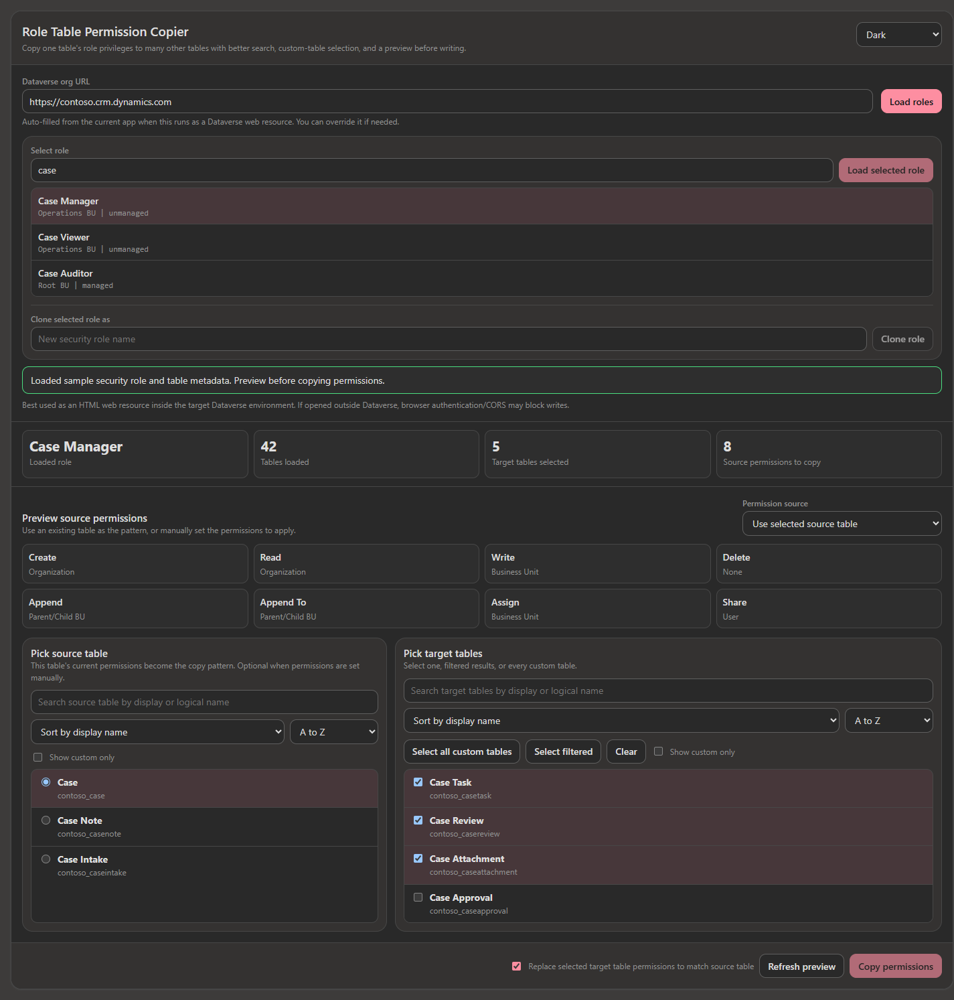
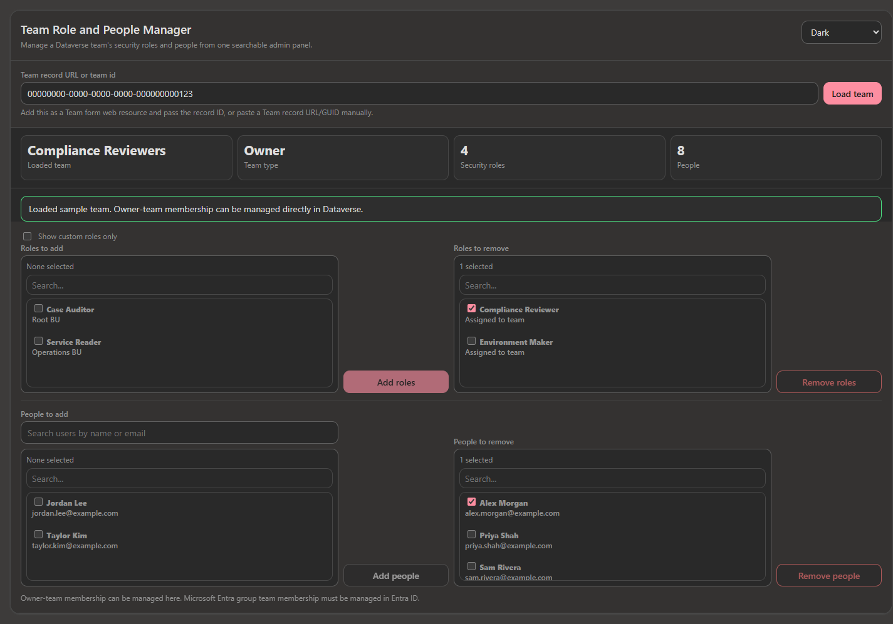

# Dataverse Security Tools

This documentation covers five HTML web resources built to make Dataverse and Power Platform administration easier inside model-driven apps:

1. **User Effective Security Roles** - User form helpers for viewing and managing roles and team memberships, plus a read-only record-access view for shares, Field Security Profiles, and hierarchy context.
2. **Role Table Permission Copier** - an admin helper for cloning roles and copying table permission patterns across many tables.
3. **Team Role and People Manager** - a Team form helper for managing team security roles and owner-team membership, with read-only Entra group membership handling.
4. **Flow Dependency Viewer** - a solution-level helper for viewing cloud-flow dependencies, activation order, required environment variables, and missing environment-variable values.
5. **Solution Service Inspector** - an inventory helper for reviewing solutions, apps, flows, connected services, SharePoint URLs, sharing signals, and non-authoritative migration signals.

All tools are designed to run as **Dataverse HTML web resources** so they can use the signed-in admin's Dataverse context and `Xrm.WebApi`.

## Files

| Tool | Repository path |
|---|---|
| User Effective Security Roles | [HTML](../tools/user-effective-security-roles/src/UserEffectiveSecurityRoles.html) |
| Role Table Permission Copier | [HTML](../tools/role-table-permission-copier/src/RoleTablePermissionCopier.html) |
| Team Role and People Manager | [HTML](../tools/team-role-people-manager/src/TeamRolePeopleManager.html) |
| Flow Dependency Viewer | [HTML web resource](../tools/flow-dependency-viewer/solution/src/WebResources/fdv_/flowdependencyviewer.htm) |
| Solution Service Inspector | [HTML](../tools/solution-service-inspector/src/SolutionServiceInspector.html) |
| User Effective Security Roles unmanaged solution | [ZIP](../packages/user-effective-security-roles/UserEffectiveSecurityRolesSolution.zip) |
| User Effective Security Roles managed solution | [ZIP](../packages/user-effective-security-roles/UserEffectiveSecurityRolesSolution_managed.zip) |
| Role Table Permission Copier unmanaged solution | [ZIP](../packages/role-table-permission-copier/RoleTablePermissionCopierSolution.zip) |
| Role Table Permission Copier managed solution | [ZIP](../packages/role-table-permission-copier/RoleTablePermissionCopierSolution_managed.zip) |
| Team Role and People Manager unmanaged solution | [ZIP](../packages/team-role-people-manager/TeamRolePeopleManagerSolution.zip) |
| Team Role and People Manager managed solution | [ZIP](../packages/team-role-people-manager/TeamRolePeopleManagerSolution_managed.zip) |
| Flow Dependency Viewer unmanaged solution | [ZIP](../packages/flow-dependency-viewer/FlowDependencyViewerSolution.zip) |
| Flow Dependency Viewer managed solution | [ZIP](../packages/flow-dependency-viewer/FlowDependencyViewerSolution_managed.zip) |
| Solution Service Inspector unmanaged solution | [ZIP](../packages/solution-service-inspector/SolutionServiceInspectorSolution.zip) |
| Solution Service Inspector managed solution | [ZIP](../packages/solution-service-inspector/SolutionServiceInspectorSolution_managed.zip) |

## Screenshots

Screenshots use sanitized sample data.

| Tool | Screenshot |
|---|---|
| User Effective Security Roles |  |
| User Record Access |  |
| Role Table Permission Copier |  |
| Team Role and People Manager |  |
| Flow Dependency Viewer |  |

## Recommended deployment

1. Open **make.powerapps.com**.
2. Select the target Dataverse environment.
3. Open or create an admin/customization solution.
4. Choose one deployment path:
   - **Packaged install:** import the tool's managed or unmanaged solution ZIP from `packages`.
   - **Manual install:** add the tool's HTML file as a **Webpage (HTML)** web resource.
5. Publish customizations.
6. Add the web resource to an admin model-driven app.

Recommended placement:

| Tool | Recommended location |
|---|---|
| User Effective Security Roles | User (`systemuser`) form; pass the record ID |
| Role Table Permission Copier | Standalone admin app page/navigation item |
| Team Role and People Manager | Team (`team`) form; pass the record ID |
| Flow Dependency Viewer | Standalone admin app page/navigation item; optionally pass `solutionReference` |
| Solution Service Inspector | Standalone admin app page/navigation item; same-environment solution/app/flow inventory |

## Security model

These tools do **not** bypass Dataverse security. They run as the currently signed-in user and require that user to have the privileges needed to read users, roles, teams, metadata, solutions, cloud flows, dependencies, environment variables, and to update role/team assignments, role privileges, or flow state.

For Entra-backed teams, membership is shown read-only and managed through Microsoft Entra ID. The Team manager includes a link to the Entra group when Dataverse exposes the group object ID.

## Documentation

- [User Effective Security Roles](UserEffectiveSecurityRoles.md)
- [Role Table Permission Copier](RoleTablePermissionCopier.md)
- [Team Role and People Manager](TeamRolePeopleManager.md)
- [Flow Dependency Viewer](FlowDependencyViewer.md)
- [Solution Service Inspector](SolutionServiceInspector.md)
- [LinkedIn article draft](articles/LinkedInArticle.md)
- [LinkedIn copy/paste text](articles/LinkedInArticle_CopyPaste.txt)
