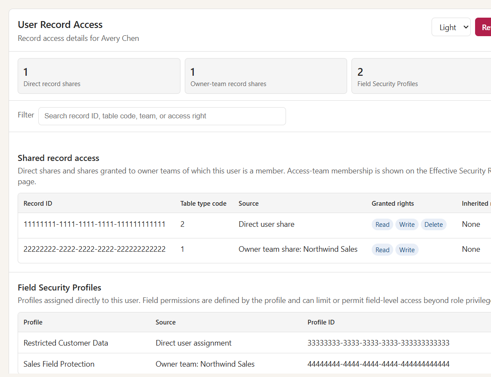

# User Effective Security Roles

## Purpose

The **User Effective Security Roles** web resource gives administrators a cleaner way to view and manage a user's Dataverse access directly from the User form.

It combines:

- Direct security roles assigned to the user
- Team-inherited security roles
- Record-specific access team memberships
- Owner-team memberships
- Add/remove role and team assignment actions
- Copy assignments from another user

## File

Repository path:

[tools\user-effective-security-roles\src\UserEffectiveSecurityRoles.html](../tools/user-effective-security-roles/src/UserEffectiveSecurityRoles.html)

[tools\user-effective-security-roles\src\UserRecordAccess.html](../tools/user-effective-security-roles/src/UserRecordAccess.html)

Package paths:

[Unmanaged ZIP](../packages/user-effective-security-roles/UserEffectiveSecurityRolesSolution.zip)

[Managed ZIP](../packages/user-effective-security-roles/UserEffectiveSecurityRolesSolution_managed.zip)

## Screenshot




## Where to use it

Add this HTML file as a Dataverse **Webpage (HTML) web resource**, then place it on the **User (`systemuser`) form** in a model-driven app.

When adding the web resource to the form, enable:

**Pass record object-type code and unique identifier as parameters**

Both web resources use the current User record ID to load information for that user. Add either or both to the User form. The Effective Security Roles page includes management actions; User Record Access is read-only.

## Main features

### Effective role visibility

The tool shows both:

- **Direct roles** from `systemuserroles`
- **Team-inherited roles** from `teammembership` -> `teamroles`

This helps admins see what a user actually has, not just what is directly assigned.

### Search and sorting

The results table supports:

- Search by role name, business unit, team name, or ID
- Source filtering: all, direct only, team-inherited only, or both
- Sortable headers for role, business unit, source, and source team
- Clickable links to Role and Team records

### Manage direct roles

Admins can add or remove one or more direct role assignments using searchable multi-select controls.

The tool uses the Dataverse Web API `Associate` and `Disassociate` operations with:

- `systemuserroles_association`
- `role`
- `systemuser`

### Manage team memberships

Admins can associate or remove the user from owner teams.

The tool uses:

- `teammembership_association`
- `team`
- `systemuser`

Microsoft Entra group team membership is intentionally not managed by this tool because that must be managed in Entra ID.

### Copy assignments from another user

Admins can search for another user and copy:

- Direct security role assignments
- Removable owner-team memberships

For roles, the tool attempts to map the source user's roles to matching roles in the target user's business unit. Existing assignments are kept.

### Record access teams

The Effective Security Roles page lists record-specific access team memberships below the effective roles table. These are unique permissions on individual records, not reusable security roles.

For each access team membership, the page attempts to show:

- Target record name and clickable record link
- Target table display/logical name
- Access team name
- Access team template name
- Access rights from the template, such as Read, Write, Append, Append To, Delete, Share, and Assign

The page resolves access-team target records dynamically from `team.regardingobjectid` and the team template/object type metadata. If a record or metadata cannot be read by the current admin, the row still appears where possible with an unavailable-record indicator.

### User Record Access

The companion **User Record Access** page covers record-level and field-level permission sources that are separate from security roles:

- Direct record shares assigned to the user
- Record shares assigned to owner teams of which the user is a member
- Direct and owner-team Field Security Profile assignments
- Manager and position hierarchy context

Record shares come from `principalobjectaccess` and include explicit and inherited access-right masks. The page reports object IDs and table type codes because Dataverse does not expose a universal record-name lookup through `principalobjectaccess`.

Manager and position are context only. The page does not attempt to calculate access granted through a Dataverse hierarchy security model. It also does not duplicate Access Team memberships, which remain on the Effective Security Roles page.

### Role-based access to the tool

The tool includes configurable access rules in the script:

```js
const ACCESS_RULES = {
  viewRoleNames: ["System Administrator", "System Customizer", "Security Role Viewer", "Security Role Manager"],
  manageRoleNames: ["System Administrator", "Security Role Manager"]
};
```

Users without a view role do not see the panel. Users with view access but not manage access see the data as read-only.

### Light and dark mode

Both pages support light/dark display, provide a theme selector, and detect model-driven app dark mode from the URL where possible.

## Required privileges

The current user needs Dataverse privileges to:

- Read users
- Read roles
- Read teams
- Read team memberships and role associations
- Read access team records, team templates, and target records where possible
- Read `principalobjectaccess` record-share entries
- Read Field Security Profiles and profile assignments
- Assign/remove security roles
- Associate/remove users from owner teams

If a user can see data but cannot complete an add/remove action, check their Dataverse security role privileges.

## Limitations

- Does not manage Entra group team membership.
- Access team membership is shown as record-specific visibility; access teams do not grant reusable security roles.
- User Record Access reports explicit user and owner-team shares, not every record reachable through role depth, ownership, hierarchy security, app access, or licenses.
- Field Security Profile assignments are shown, but the page does not enumerate every secured field permission in each profile.
- Target record names/links depend on the current admin's read access to those records and metadata.
- Does not bypass Dataverse security.
- Role copying maps roles by matching role IDs, root role IDs, or role names where possible.
- Works best when hosted inside Dataverse as an HTML web resource.

## Troubleshooting

| Symptom | Likely cause |
|---|---|
| Page cannot find the user | Web resource was not configured to pass record ID parameters |
| Add/remove buttons disabled | Current user lacks manage role per `ACCESS_RULES`, or nothing is selected |
| Add/remove operation fails | Current user lacks Dataverse privileges to manage roles or team memberships |
| Team is not listed | Tool only manages removable owner-team memberships |
| Access team row shows record unavailable | Current user may not have read access to the target record or table metadata |
| No access teams appear | User may not be in any access teams, or current admin cannot read access-team membership/template data |
| Record shares or Field Security Profiles cannot be loaded | Current user may lack read access to `principalobjectaccess`, Field Security Profiles, or the required association data |
| Dark mode does not match | Browser/app URL may not expose the model-driven app theme flag |

## Related tools

- [Role Table Permission Copier](RoleTablePermissionCopier.md)
- [Team Role and People Manager](TeamRolePeopleManager.md)
- [Flow Dependency Viewer](FlowDependencyViewer.md)
