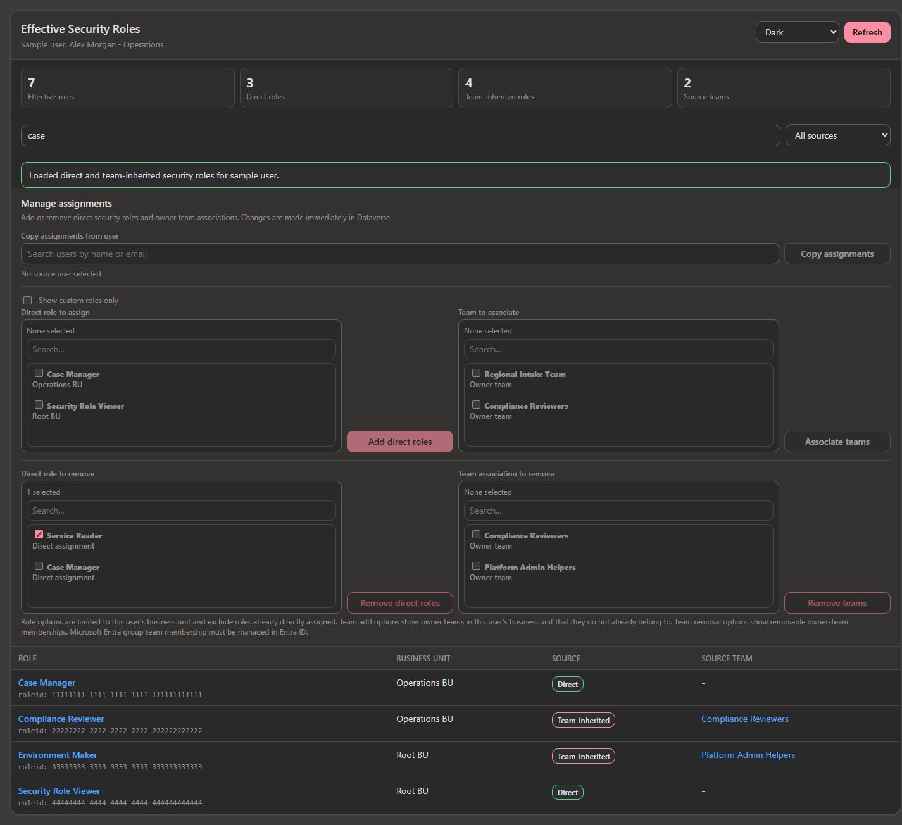

# User Effective Security Roles

## Purpose

The **User Effective Security Roles** web resource gives administrators a cleaner way to view and manage a user's Dataverse access directly from the User form.

It combines:

- Direct security roles assigned to the user
- Team-inherited security roles
- Owner-team memberships
- Add/remove role and team assignment actions
- Copy assignments from another user

## File

Repository path:

[src\UserEffectiveSecurityRoles.html](src/UserEffectiveSecurityRoles.html)

Package paths:

[Unmanaged ZIP](../../packages/user-effective-security-roles/UserEffectiveSecurityRolesSolution.zip)

[Managed ZIP](../../packages/user-effective-security-roles/UserEffectiveSecurityRolesSolution_managed.zip)

## Screenshot



## Where to use it

Add this HTML file as a Dataverse **Webpage (HTML) web resource**, then place it on the **User (`systemuser`) form** in a model-driven app.

When adding the web resource to the form, enable:

**Pass record object-type code and unique identifier as parameters**

The web resource uses the current User record ID to load and manage assignments for that user.

## Main features

### Effective role visibility

The tool shows both:

- **Direct roles** from `systemuserroles`
- **Team-inherited roles** from `teammembership` -> `teamroles`

This helps admins see what a user actually has, not just what is directly assigned.

### Search and sorting

The results table supports:

- Search by role name, business unit, team name, or ID
- Source filtering: all, direct only, team-inherited only, or both
- Sortable headers for role, business unit, source, and source team
- Clickable links to Role and Team records

### Manage direct roles

Admins can add or remove one or more direct role assignments using searchable multi-select controls.

The tool uses the Dataverse Web API `Associate` and `Disassociate` operations with:

- `systemuserroles_association`
- `role`
- `systemuser`

### Manage team memberships

Admins can associate or remove the user from owner teams.

The tool uses:

- `teammembership_association`
- `team`
- `systemuser`

Microsoft Entra group team membership is intentionally not managed by this tool because that must be managed in Entra ID.

### Copy assignments from another user

Admins can search for another user and copy:

- Direct security role assignments
- Removable owner-team memberships

For roles, the tool attempts to map the source user's roles to matching roles in the target user's business unit. Existing assignments are kept.

### Role-based access to the tool

The tool includes configurable access rules in the script:

```js
const ACCESS_RULES = {
  viewRoleNames: ["System Administrator", "System Customizer", "Security Role Viewer", "Security Role Manager"],
  manageRoleNames: ["System Administrator", "Security Role Manager"]
};
```

Users without a view role do not see the panel. Users with view access but not manage access see the data as read-only.

### Light and dark mode

The tool supports light/dark display and detects model-driven app dark mode from the URL where possible.

## Required privileges

The current user needs Dataverse privileges to:

- Read users
- Read roles
- Read teams
- Read team memberships and role associations
- Assign/remove security roles
- Associate/remove users from owner teams

If a user can see data but cannot complete an add/remove action, check their Dataverse security role privileges.

## Limitations

- Does not manage Entra group team membership.
- Does not bypass Dataverse security.
- Role copying maps roles by matching role IDs, root role IDs, or role names where possible.
- Works best when hosted inside Dataverse as an HTML web resource.

## Troubleshooting

| Symptom | Likely cause |
|---|---|
| Page cannot find the user | Web resource was not configured to pass record ID parameters |
| Add/remove buttons disabled | Current user lacks manage role per `ACCESS_RULES`, or nothing is selected |
| Add/remove operation fails | Current user lacks Dataverse privileges to manage roles or team memberships |
| Team is not listed | Tool only manages removable owner-team memberships |
| Dark mode does not match | Browser/app URL may not expose the model-driven app theme flag |

## Related tools

- [Role Table Permission Copier](../role-table-permission-copier/README.md)
- [Team Role and People Manager](../team-role-people-manager/README.md)
- [Flow Dependency Viewer](../flow-dependency-viewer/README.md)
